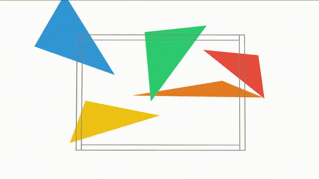

# 2D Triangle Packing

**Goal:** The goal is to pack a set of triangles into a tight goal region using differentiable parallelized
optimization. The
constraints are:

1. Each triangle must be inside the goal region.
2. No two triangles may overlap.

**Your task:** implement an optimizer in [optimize.py](optimize.py) that solves for the $xy$ position and $\theta$
rotation of each triangle to satisfy these constraints. This requires implementing:

1. Cost functions corresponding to these constraints
2. A parallelized differentiable optimizer to minimize these costs
3. Checking that the constraints are satisfied

Your optimizer should be able to reliably solve all problems with 3-6 triangles. We provide the time required to find a
solution for our reference implementation in the table at the end of this README. You should generate a similar table
for your implementation. You could modify the [run_experiments.py](run_experiments.py) script to do this. If you have
limited compute, you can reduce the number of trials and only run on problems with a smaller number of triangles.

**Extension:** add a soft cost to pack the triangles towards the right of the goal region, i.e., maximize the
$x$-positions of the triangle while respecting the constraints.

## Installation Tips

- Use Python 3.10+.
- Install PyTorch following the instructions here: https://pytorch.org/get-started/locally/
- Other dependencies: `pip install rerun-sdk`

## Implementation Tips

You should focus on getting a working implementation first before trying to improve it. Here are some tips:

- You should be able to implement this in pure PyTorch. You should write vectorized PyTorch code.
- Given we are doing numerical optimization, you should set small tolerances when checking if constraints have been
  satisfied (e.g., 1e-3).
- Think carefully about what collision representation you want to use (circles, meshes, SDFs, etc.).

You should try to design and write the majority of the code yourself. You are welcome to use Copilot, Cursor, etc. to
assist you with completing this task. However, you will be expected to be able to explain your code and the design
decisions you made. Email us if you need help or more tips.

## Expected Results

Here are the results based on our reference implementation over 5 runs for each problem. For time to first solution, we
show the mean and 95% confidence interval in seconds. For reference, this was run on a RTX 5880 GPU with a batch size
of 512. If you are using PyTorch with CPU, you should expect much slower times.

You should generate a table of results similar to this for your implementation. You could modify
the [run_experiments.py](run_experiments.py) script.

| #Triangles | Environment | Time to Solution |
|-----------:|------------:|:-----------------|
|          3 |           0 | 0.718 ± 0.497    |
|          3 |           1 | 0.781 ± 0.228    |
|          3 |           2 | 0.379 ± 0.194    |
|          3 |           3 | 0.927 ± 0.114    |
|          3 |           4 | 0.613 ± 0.133    |
|          3 |           5 | 0.750 ± 0.086    |
|          3 |           6 | 3.455 ± 3.002    |
|          3 |           7 | 0.764 ± 0.150    |
|          3 |           8 | 2.635 ± 0.893    |
|          3 |           9 | 0.327 ± 0.051    |
|          4 |           0 | 6.646 ± 5.202    |
|          4 |           1 | 1.887 ± 0.495    |
|          4 |           2 | 2.803 ± 0.663    |
|          4 |           3 | 4.241 ± 2.039    |
|          4 |           4 | 3.509 ± 1.839    |
|          4 |           5 | 2.014 ± 0.741    |
|          4 |           6 | 3.416 ± 1.698    |
|          4 |           7 | 1.329 ± 0.343    |
|          4 |           8 | 2.946 ± 1.352    |
|          4 |           9 | 2.346 ± 0.826    |
|          5 |           0 | 1.784 ± 0.321    |
|          5 |           1 | 3.076 ± 1.150    |
|          5 |           2 | 4.822 ± 1.203    |
|          5 |           3 | 6.637 ± 3.200    |
|          5 |           4 | 14.879 ± 3.389   |
|          5 |           5 | 5.718 ± 1.437    |
|          5 |           6 | 13.434 ± 6.822   |
|          5 |           7 | 3.000 ± 0.440    |
|          5 |           8 | 3.146 ± 0.254    |
|          5 |           9 | 3.079 ± 1.149    |
|          6 |           0 | 3.027 ± 1.064    |
|          6 |           1 | 4.509 ± 1.343    |
|          6 |           2 | 16.545 ± 8.200   |
|          6 |           3 | 5.981 ± 2.726    |
|          6 |           4 | 5.263 ± 1.390    |
|          6 |           5 | 5.051 ± 0.717    |
|          6 |           6 | 8.160 ± 1.764    |
|          6 |           7 | 10.307 ± 3.988   |
|          6 |           8 | 14.569 ± 6.031   |
|          6 |           9 | 4.342 ± 0.690    |